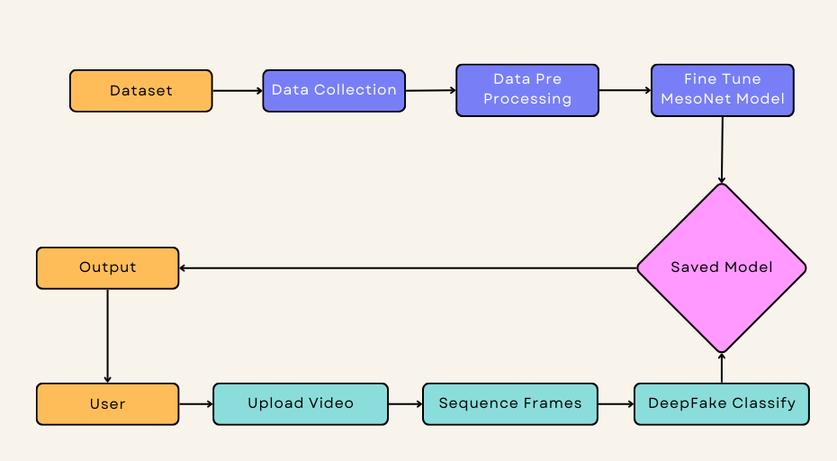
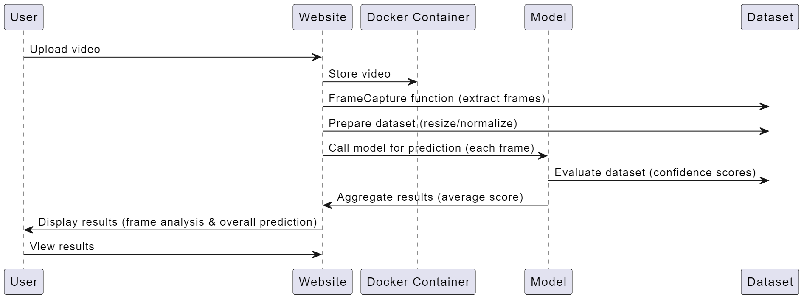
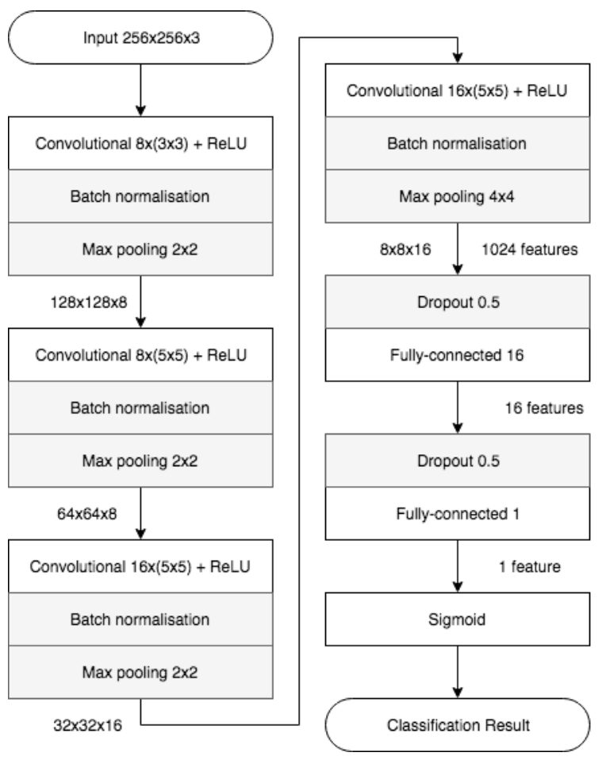
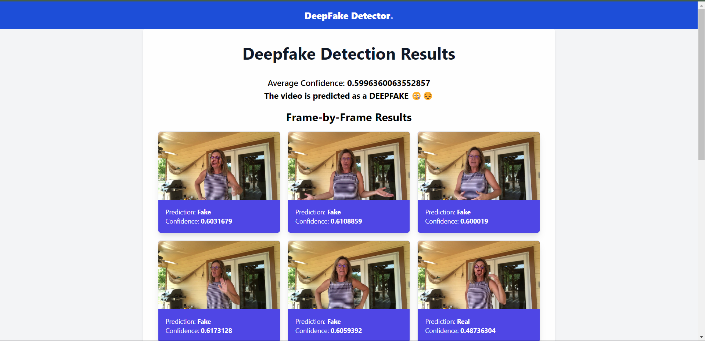
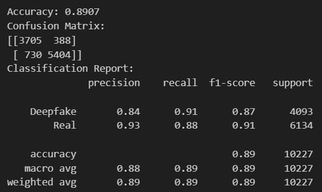

# **Detection of Deepfake Media**

This application detects deepfake content in uploaded videos by extracting frames and analyzing them using a pre-trained deep learning model, **MesoNet**, specifically designed for deepfake detection.

## **About**

The **Detection of Deepfake Media** is designed to verify video authenticity by detecting manipulated video content using advanced machine learning techniques. Leveraging the power of the MesoNet architecture, this project provides an intuitive interface that allows users to upload videos for real-time analysis. The system processes frames from each video, predicting whether they are genuine or deepfakes, along with a confidence score.

## **Features**

- **Video Upload:** Users can upload MP4 videos for deepfake detection.
- **Frame-by-Frame Analysis:** Each frame of the video is analyzed individually for accurate detection.
- **Confidence Score:** The system provides a confidence score for each frame, showing the likelihood of it being a deepfake.
- **Detailed Results:** The results include a comprehensive breakdown of real and fake frames.
- **User-Friendly Interface:** Simple design for easy navigation and interaction, accessible to non-technical users.
  
## **Development Requirements**

- **Operating System:** Requires a 64-bit OS (Windows 10, macOS, or Ubuntu) for compatibility with deep learning frameworks.
- **Development Environment:** Python 3.10 or later is required for the implementation of the Detection of Deepfake Media.
- **Deep Learning Frameworks:** Tensorflow is used for training and implementing the MesoNet model.
- **Image Processing Libraries:** OpenCV is essential for extracting and processing video frames.
- **Version Control:** Git for collaborative development and version control.
- **IDE:** VSCode or PyCharm is recommended for coding and debugging.
- **Additional Dependencies:** Includes NumPy, Scikit-learn, Django, Pillow, and Matplotlib.

## **System Architecture**

- **Frontend:** HTML5, CSS3, JavaScript for the user interface.
- **Backend:** Django for handling requests and integrating the detection model.
- **Model:** MesoNet model fine-tuned on the CelebDF dataset, trained to identify deepfake videos.
- **Database:** A Local storage system for uploaded videos and analysis results.

### **Diagram of System Architecture**





## MesoNet Model

The application leverages the **MesoNet** model, a specialized deep learning architecture for detecting deepfake content by analyzing mesoscopic features of images. 

- **Efficient Detection**: MesoNet uses shallow convolutional layers to capture subtle artifacts introduced by deepfake generation techniques.
- **Variants**: The model comes in two forms, Meso-4 (lightweight) and MesoInception-4 (with inception modules for multi-scale feature extraction). In this application, we use a pre-trained version optimized for deepfake detection.
- **Frame Evaluation**: Each extracted frame is passed through the MesoNet model, and the system generates confidence scores indicating the likelihood of deepfake content.

### Model Architecture



## Prerequisites

Ensure you have Docker installed on your system.

## Installation

1. *Clone the repository:*

   ```
   git clone https://github.com/ShafeeqAhamedS/deepfake-detection.git
   cd deepfake-detection
   ```
   

2. *Create a virtual environment (optional but recommended):*

   ```
   python -m venv venv
   venv\Scripts\activate
   ```
   

3. *Install the required libraries:*

   ```
   pip install -r requirements.txt
   ```
   
4. *Run the Django development server:*

   ```
   python manage.py runserver 3000
   ````

5. *Open your web browser and navigate to:*

   ```
   http://127.0.0.1:3000/
   ```

6. *Upload a video:*

   - Click on upload video to upload a video file.
   - The server will process the video, extract frames, and evaluate them using the deepfake detection model.

7. *View the results:*

   - The results page will display each frame's evaluation, including the confidence score and the overall prediction for the video.


## Setup with Docker

1. **Pull the Docker Image:**

   ```bash
   docker pull shafeeq2804/deepfake-detection
   ```

2. **Run the Docker Container:**

   ```bash
   docker run -p 3000:3000 shafeeq2804/deepfake-detection
   ```

3. **Access the Web Interface:**

   Visit [http://127.0.0.1:3000/](http://127.0.0.1:3000/) in your web browser.

4. **Upload a Video:**

   - Upload a video for analysis.
   - The system will process the video, extract frames, and analyze them for deepfake content using the MesoNet model.

5. **View Results:**

   Results, including confidence scores for each frame and an overall prediction, are displayed after processing.

## Project Structure

- **`models/deepfake_detection_model.h5`**: The pre-trained MesoNet model used for deepfake detection.
- **`media/`**: Directory to store uploaded videos and extracted frames.
- **`app/`**: The Django app containing:
  - `views.py`: Logic for video upload, frame extraction, and analysis.
  - `forms.py`: Contains the form for video uploads.
  - `templates/`: HTML templates for the web interface.

## Key Functions

- **`FrameCapture(path)`**: Extracts frames from the video.
- **`evaluate_frames(directory)`**: Evaluates frames for deepfake content using the MesoNet model.
- **`upload_video(request)`**: Handles the video upload, triggering frame extraction and analysis.

## **Output**

### **Output 1 – Deepfake Detection Results**


### **Output 2 – Model Accuracy**


- **Detection Accuracy:** ~89% (This value reflects the performance metrics of the MesoNet model on the selected dataset.)

## **Results and Impact**

- Successfully implemented a web-based platform for deepfake detection using machine learning.
- Provides a frame-by-frame analysis for a granular understanding of the detection process.
- Confidence scores help users interpret the system’s decision-making process.
- The project addresses the growing issue of deepfake misinformation by providing a tool for video verification.

## **Articles References**

- Xia, Z.; Qiao, T.; Xu, M.; Wu, X.; Han, L.; Chen, Y. *Deepfake Video Detection Based on MesoNet with Preprocessing Module*. Symmetry 2022, 14, 939. https://doi.org/10.3390/sym14050939

- M. S. Rana, M. N. Nobi, B. Murali and A. H. Sung, *Deepfake Detection: A Systematic Literature Review* in IEEE Access, vol. 10, pp. 25494-25513, 2022, https://doi.org/10.1109/ACCESS.2022.3154404

- Zi, Bojia and Chang, Minghao and Chen, Jingjing and Ma, Xingjun and Jiang, Yu-Gang. *WildDeepfake: A Challenging Real-World Dataset for Deepfake Detection*. arXiv 2024 https://arxiv.org/abs/2101.01456

- Afchar, Darius and Nozick, Vincent and Yamagishi, Junichi and Echizen, Isao. *MesoNet: a Compact Facial Video Forgery Detection Network*. IEEE 2018. http://dx.doi.org/10.1109/WIFS.2018.8630761
