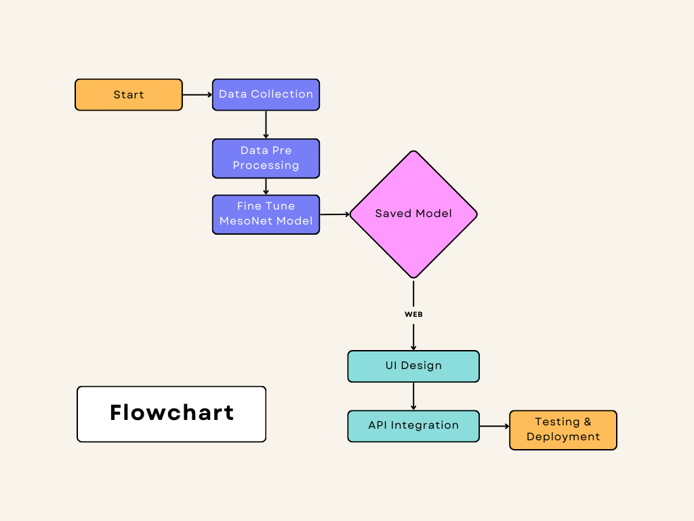

# Detection of Deepfake Media

This application detects deepfake content in uploaded videos by extracting frames and analyzing them using a pre-trained deep learning model, **MesoNet**, specifically designed for deepfake detection.

### Project Flow



## Key Features

- **Video Upload**: Simple web interface for users to upload videos.
- **Frame Extraction**: Automatic extraction of frames from uploaded videos.
- **Deepfake Detection**: Each frame is analyzed for deepfake content using the MesoNet model.
- **Results Display**: Confidence scores for each frame along with an overall deepfake prediction for the video.

## MesoNet Model

The application leverages the **MesoNet** model, a specialized deep learning architecture for detecting deepfake content by analyzing mesoscopic features of images. 

- **Efficient Detection**: MesoNet uses shallow convolutional layers to capture subtle artifacts introduced by deepfake generation techniques.
- **Variants**: The model comes in two forms, Meso-4 (lightweight) and MesoInception-4 (with inception modules for multi-scale feature extraction). In this application, we use a pre-trained version optimized for deepfake detection.
- **Frame Evaluation**: Each extracted frame is passed through the MesoNet model, and the system generates confidence scores indicating the likelihood of deepfake content.

### Model Architecture


## Prerequisites

Ensure you have Docker installed on your system.

## Setup with Docker

1. **Pull the Docker Image:**

   ```bash
   docker pull shafeeq2804/deepfake-detection
   ```

2. **Run the Docker Container:**

   ```bash
   docker run -p 3000:3000 shafeeq2804/deepfake-detection
   ```

3. **Access the Web Interface:**

   Visit [http://127.0.0.1:3000/](http://127.0.0.1:3000/) in your web browser.

4. **Upload a Video:**

   - Upload a video for analysis.
   - The system will process the video, extract frames, and analyze them for deepfake content using the MesoNet model.

5. **View Results:**

   Results, including confidence scores for each frame and an overall prediction, are displayed after processing.

## Project Structure

- **`models/deepfake_detection_model.h5`**: The pre-trained MesoNet model used for deepfake detection.
- **`media/`**: Directory to store uploaded videos and extracted frames.
- **`app/`**: The Django app containing:
  - `views.py`: Logic for video upload, frame extraction, and analysis.
  - `forms.py`: Contains the form for video uploads.
  - `templates/`: HTML templates for the web interface.

## Key Functions

- **`FrameCapture(path)`**: Extracts frames from the video.
- **`evaluate_frames(directory)`**: Evaluates frames for deepfake content using the MesoNet model.
- **`upload_video(request)`**: Handles the video upload, triggering frame extraction and analysis.